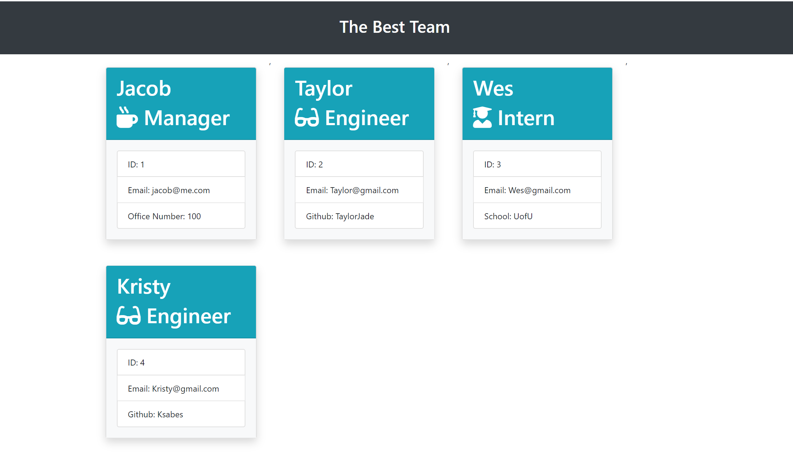

# Project Title
​
## Overview
​
The purpose of this application is to dynamically generate a graphic with a teams personell portfolio.
​
### Gallery
​
End Result

​
The Process

​
​
### Problem
​
A manager
wants to generate a webpage that displays their team's basic info
so that they have quick access to emails and GitHub profiles.

​
### Solution
​
I will create a command line application that will request information about each team member and dynamically generate an html that displays a visually apealing list of the team members.
​
## Tech and Features Used
​
* Bootstrap
* Javascript
* Node.js
* Node Librarys:
Inquirer - Util
* HTML
​
## How to use
​
* Clone this repo
* Navigate to the folder this was cloned to and run npm i.
* run 'node app.js' in the command line
* type in each team members name and additional information as the application prompts.
* at the end it will ask for your team name, this name with be the name of the file that the application creates.
* in the folder of this cloned repor there is a folder called output. This is where you will find the html with your team name.
​
## Technical Overview
​
1. There are severel components to this application that are very important.
Inquirer, Node, and the npm library, classes and extends to sub classes.
2. Inquirer allowys me to create command line prompts that saves the information I am collecting to an array. Because I am saving it to an array and not local storage or a database, that array clears as the application closes.
3. The app started with one Class called employee, and then there are sub classes, Intern, Manager and Engineer that employee extends to.
